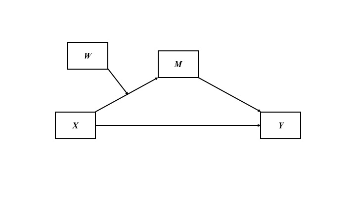
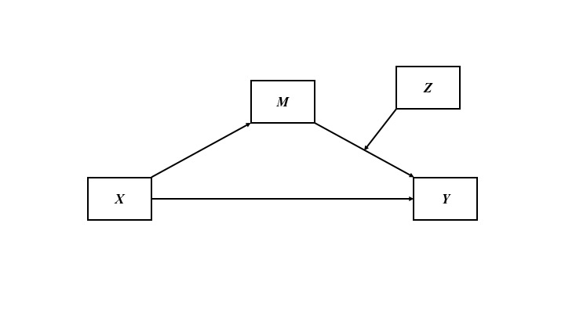

## What is mediation?
> There are many ways to define mediation and mediators. Here's one way: Mediation is the process by which one variable transmits an effect onto another. For example, as room temperature increases, people get thirstier, and then they drink more water. In this case, thirst transmits the effect of room temperature on water drinking.

## What is an indirect effect?
> The indirect effect quantifies a mediation effect, if such an effect exists. Referring to the thirst example above, in statistical terms, the indirect effect quantifies the extent to which room temperature affects water drinking indirectly through thirstiness. If you're familiar with interpreting regression coefficients and the idea of controlling for other variables, then you might find it intuitive to think of the indirect effect as the decrease in the relationship between room temperature and water drinking after you've partialed out the association between room temperature and thirtiness. In other words, how much does the coefficient for room temperature decrease when you control for thirstiness?

## What is moderation?
> Moderation refers to how some variable modifies the direction or the strength of the association between two variables. In other words, a moderator variable qualifies the relation between two variables. A moderator is not a part of some proposed causal process; instead, it interacts with the relation between two variables in such a way that their relation is stronger, weaker, or opposite in direction—depending on values of the moderator. For example, as room temperature increases, people may report feeling thirstier. But that may depend on how physically fit people are. Maybe physically fit people don't report feeling thirsty as room temperature increases, or maybe physically fit people—compared to less physically fit people—have a higher room temperature threshold at which they start feeling thirstier. 

## What is a conditional indirect effect (i.e., moderated mediation)?

## What is the Index of Moderated Mediation?

## Model and Conceptual Assumptions
> * **Correct functional form.** Your model variables share linear relationships and don't interact with eachother.
> * **No omitted influences.** This one is hard: Your model accounts for all relevant influences on the variables included. All models are wrong, but how wrong is yours? 
> * **Accurate measurement.** Your measurements are valid and reliable. Note that unreliable measures can't be valid, and reliable measures don't necessairly measure just one construct or even your construct.
> * **Well-behaved residuals.** Residuals (i.e., prediction errors) aren't correlated with predictor variables or eachother, and residuals have constant variance across values of your predictor variables. Also, residual error terms aren't correlated across regression equations. This could happen if, for example, some omitted variable causes both thirst and water drinking.

## Conceptual Diagrams
  



## Libraries

```{r, message = FALSE, warning = FALSE}

library(tidyverse)
library(knitr)
library(lavaan)
library(psych)

```

## Data
> I combined the data from Table 3.1 in Mackinnon (2008, p. 56) [[**.csv**](https://raw.githubusercontent.com/nmmichalak/nicholas_michalak/master/blog_entries/2018/nrg01/data/mackinnon_2008_t3.1.csv)] with those from Table 10.1 in Mackinnon (2008, p. 291) [[**.csv**](https://raw.githubusercontent.com/nmmichalak/nicholas_michalak/master/blog_entries/2018/nrg02/data/mackinnon_2008_t10.1.csv)]

```{r, message = FALSE, warning = FALSE}

thirst_norm <- "https://raw.githubusercontent.com/nmmichalak/nicholas_michalak/master/blog_entries/2018/nrg01/data/mackinnon_2008_t3.1.csv" %>% read_csv()
thirst_fit <- "data/mackinnon_2008_t10.1.csv" %>% read_csv()

```

## Code new IDs for fit data

```{r}

thirst_fit <- thirst_fit %>% mutate(id = 51:100)

```

## Add column in both datasets that identifies fitness group
> Unfit = -0.5 and Fit = 0.5

```{r}

thirst_norm <- thirst_norm %>% mutate(phys_fit = -0.5)
thirst_fit <- thirst_fit %>% mutate(phys_fit = 0.5)

```

## Bind unfit and fit data by rows
> Imagine stacking these datasets on top of eachother

```{r}

thirst_data <- bind_rows(thirst_norm, thirst_fit)

```

## Compute interaction terms

```{r}

thirst_data <- thirst_data %>% mutate(tmp_fit = room_temp * phys_fit,
                                      thrst_fit = thirst * phys_fit)

```

### Print first and last five observations

```{r}

thirst_data %>% 
  headTail() %>% 
  kable()

```

## Visualize relationships
> It's always a good idea to look at your data. Check some assumptions. 

```{r}

thirst_data %>% 
  select(room_temp, thirst, consume, phys_fit, tmp_fit, thrst_fit) %>% 
  pairs.panels()

```

## Write model to test conditional indirect effect using `sem()` from lavaan
> * `~` = Regress onto ...
> * Within the regression models, I label coefficients with the astrix.
> * `:=` = Define a new parameter. Note when you define a new parameter with `:=`, you can use the astrix to multiply values
> * For more details about lavaan syntax, see the tutorials tab at the lavaan website (linked in Resources below)

```{r}

mod1 <- "# a path
         thirst ~ a1 * room_temp
         thirst ~ a2 * phys_fit
         thirst ~ a3 * tmp_fit

         # b paths
         consume ~ b1 * thirst

         # c prime path 
         consume ~ cp * room_temp

         # index of moderated mediation and conditional indirect effects
         b1a3 := b1 * a3
         norm := a1 * b1 + b1a3 * -0.5
         fit := a1 * b1 + b1a3 * 0.5"

```

## Set random seed so results can be reproduced

```{r}

set.seed(1234)

```

## Fit model
> You must specify bootstrapping in the `sem()` function

```{r}

fsem1 <- sem(mod1, data = thirst_data, se = "standard")

```

## Summarize model
> standardized = TRUE adds standardized estimate to the model output. Also, see `help("standardizedsolution")`

```{r}

summary(fsem1, standardized = TRUE)

```

## Print all model parameters
> in the boot.ci.type argument, I ask for bia-corrected and accelerated confidence intervals

```{r}

parameterestimates(fsem1, boot.ci.type = "bca.simple", standardized = TRUE) %>% 
  kable()

```

## Interpretation

## Write model to test conditional indirect effect using `sem()` from lavaan
> * `~` = Regress onto ...
> * Within the regression models, I label coefficients with the astrix.
> * `:=` = Define a new parameter. Note when you define a new parameter with `:=`, you can use the astrix to multiply values
> * For more details about lavaan syntax, see the tutorials tab at the lavaan website (linked in Resources below)

```{r}

mod2 <- "# a path
         thirst ~ a1 * room_temp

         # b paths
         consume ~ b1 * thirst
         consume ~ b2 * phys_fit
         consume ~ b3 * thrst_fit

         # c prime path 
         consume ~ cp * room_temp

         # index of moderated mediation and conditional indirect effects
         a1b3 := a1 * b3
         norm := a1 * b1 + a1b3 * -0.5
         fit := a1 * b1 + a1b3 * 0.5"

```

## Fit model
> You must specify bootstrapping in the `sem()` function

```{r}

fsem2 <- sem(mod2, data = thirst_data, se = "standard")

```

## Summarize model
> standardized = TRUE adds standardized estimate to the model output. Also, see `help("standardizedsolution")`

```{r}

summary(fsem2, standardized = TRUE)

```

## Print all model parameters
> in the boot.ci.type argument, I ask for bia-corrected and accelerated confidence intervals

```{r}

parameterestimates(fsem2, boot.ci.type = "bca.simple", standardized = TRUE) %>% 
  kable()

```

## Interpretation

## Resources
> * Hayes, A. F. (2015). An index and test of linear moderated mediation. *Multivariate Behavioral Research, 50*(1), 1-22.
> * Revelle, W. (2017) How to use the psych package for mediation/moderation/regression analysis. [[**.pdf**](http://personality-project.org/r/psych/HowTo/mediation.pdf)]
> * Rosseel, Y. (2012). Lavaan: An R package for structural equation modeling and more. Version 0.5–12 (BETA). *Journal of statistical software, 48*(2), 1-36. [[**website**](http://lavaan.ugent.be/)]
> * Rucker, D. D., Preacher, K. J., Tormala, Z. L., & Petty, R. E. (2011). Mediation analysis in social psychology: Current practices and new recommendations. *Social and Personality Psychology Compass, 5*(6), 359-371. [[**.pdf**](http://quantpsy.org/pubs/rucker_preacher_tormala_petty_2011.pdf)]

## General word of caution
> Above, I listed resources prepared by experts on these and related topics. Although I generally do my best to write accurate posts, don't assume my posts are 100% accurate or that they apply to your data or research questions. Trust statistics and methodology experts, not blog posts.
