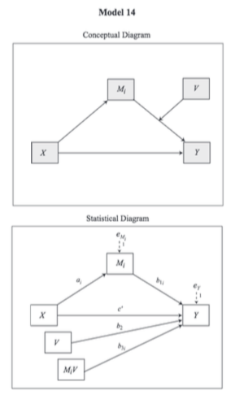

## What is a conditional indirect effect?

## What is the Index of Moderated Mediation?

## Model and Conceptual Assumptions

## Conceptual and Statistical Model



## Libraries

```{r, message = FALSE, warning = FALSE}

library(tidyverse)
library(knitr)
library(lavaan)
library(psych)

```

## Data
> * I used the data referenced in Chapter 11.3 in Hayes (2017, p. 407) [[**website**](http://afhayes.com/introduction-to-mediation-moderation-and-conditional-process-analysis.html)]
> * Here are those data [[**.csv**](https://raw.githubusercontent.com/nmmichalak/nicholas_michalak/master/blog_entries/2018/nrg02/data/teams.csv)]

```{r, message = FALSE, warning = FALSE}

teams_dat <- "data/teams.csv" %>% read_csv()

```

## Compute interaction term

```{r}

teams_dat <- teams_dat %>% mutate(oneexp = negexp * negtone)

```

### Print first and last five observations

```{r}

teams_dat %>% 
  headTail() %>% 
  kable()

```

## Visualize relationships
> It's always a good idea to look at your data. Check some assumptions. 

```{r}

teams_dat %>% 
  select(dysfunc, negtone, negexp, oneexp, perform) %>% 
  pairs.panels()

```

## Write model to test conditional indirect effect using `sem()` from lavaan
> * `~` = Regress onto ...
> * Within the regression models, I label coefficients with the astrix.
> * `:=` = Define a new parameter. Note when you define a new parameter with `:=`, you can use the astrix to multiply values
> * For more details about lavaan syntax, see the tutorials tab at the lavaan website (linked in Resources below)

```{r}

mod1 <- "# a path
         negtone ~ a1 * dysfunc

         # b paths
         perform ~ b1 * negtone
         perform ~ b2 * negexp
         perform ~ b3 * oneexp

         # c prime path 
         perform ~ cp * dysfunc

         # index of moderated mediation and conditional indirect effects
         a1b3 := a1 * b3
         lowW := a1 * b1 + a1b3 * -0.531
         modW := a1 * b1 + a1b3 * -0.060
         highW := a1 * b1 + a1b3 * 0.600"

```

## Set random seed so results can be reproduced

```{r}

set.seed(1234)

```

## Fit model
> You must specify bootstrapping in the `sem()` function

```{r}

fsem1 <- sem(mod1, data = teams_dat, se = "standard")

```

## Summarize model
> standardized = TRUE adds standardized estimate to the model output. Also, see `help("standardizedsolution")`

```{r}

summary(fsem1, standardized = TRUE)

```

## Print all model parameters
> in the boot.ci.type argument, I ask for bia-corrected and accelerated confidence intervals

```{r}

parameterestimates(fsem1, boot.ci.type = "bca.simple", standardized = TRUE) %>% 
  kable()

```

## Interpretation

## Resources
> * Hayes, A. F. (2015). An index and test of linear moderated mediation. *Multivariate Behavioral Research, 50*(1), 1-22.
> * Hayes, A. F. (2017). *Introduction to mediation, moderation, and conditional process analysis: A regression-based approach.* Guilford Publications.
> * Revelle, W. (2017) How to use the psych package for mediation/moderation/regression analysis. [[**.pdf**](http://personality-project.org/r/psych/HowTo/mediation.pdf)]
> * Rosseel, Y. (2012). Lavaan: An R package for structural equation modeling and more. Version 0.5–12 (BETA). *Journal of statistical software, 48*(2), 1-36. [[**website**](http://lavaan.ugent.be/)]
> * Rucker, D. D., Preacher, K. J., Tormala, Z. L., & Petty, R. E. (2011). Mediation analysis in social psychology: Current practices and new recommendations. *Social and Personality Psychology Compass, 5*(6), 359-371. [[**.pdf**](http://quantpsy.org/pubs/rucker_preacher_tormala_petty_2011.pdf)]

## General word of caution
> Above, I listed resources prepared by experts on these and related topics. Although I generally do my best to write accurate posts, don't assume my posts are 100% accurate or that they apply to your data or research questions. Trust statistics and methodology experts, not blog posts.
